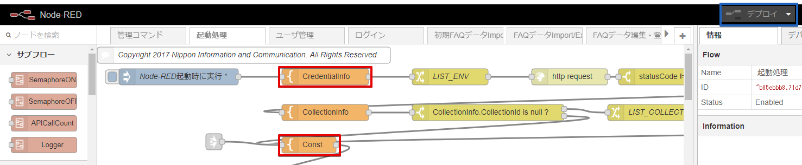
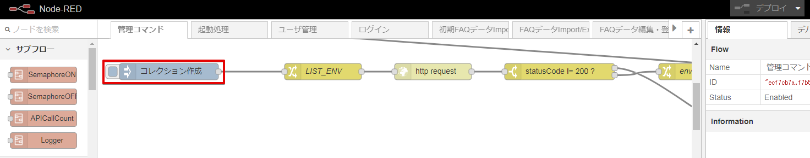

# Faq-Api
Discovery を用いたFAQ用のバックエンドAP

## 環境構築手順

### Cloudantサービスの追加
以下コマンドにより、IBM Cloud 環境に Cloudant サービスを2つ作成する。xxx部分を任意名に変更する。
```
$ bx service create cloudantnosqldb Lite xxx-faqap01-cloudantNoSQLDB
```
```
$ bx service create cloudantnosqldb Lite xxx-faqdb01-cloudantNoSQLDB
```

### manifest.yml の編集
(1) 上記で指定したxxx部分の値で manifest.yml の該当箇所を変更する。
xxx = sample とした場合の編集後サンプルは manifest-sample.yml です。

(2) FAQ管理ユーザ名(FAQ_ADMIN_USERNAME)およびパスワード(FAQ_ADMIN_PASSWORD)を任意変更する。

(3) Node-RED管理ユーザ名(NODE_RED_USERNAME)およびパスワード(NODE_RED_PASSWORD)を任意変更する。

```
applications:
- path: .
  memory: 512M
  instances: 1
  domain: mybluemix.net
  name: xxx-faqap01
  host: xxx-faqap01
  disk_quota: 1024M
  services:
  - xxx-faqap01-cloudantNoSQLDB
  - xxx-faqdb01-cloudantNoSQLDB
  env:
    NODE_RED_STORAGE_NAME: xxx-faqap01-cloudantNoSQLDB
    NODE_RED_APPLICATION_NAME: nic-faqap01
    FAQ_ADMIN_USERNAME: faqAdmin
    FAQ_ADMIN_PASSWORD: faqPassword
    NODE_RED_USERNAME: redAdmin
    NODE_RED_PASSWORD: redPassword
```

### プロジェクトのデプロイ
```
$ bx cf push -f ./manifest.yml
```

### Cloudantデータベースの作成
```
$ bx cf ssh xxx-faqap01 -c "sh /home/vcap/app/init/setup.sh"
```

### Node-REDフローエディタの設定
(1) 「起動処理」タブの CredentialInfo を開き、Discoveryサービスの資格情報(username, password)を設定する。

(2) 「起動処理」タブの Const を開き、API_KEY の値を変更する。API_KEY は Faq-Api の呼出し時にクライアント側から渡されるキーとなる。

(3) 設定変更を反映するには「デプロイ」ボタンを押下する。


(4) 「管理コマンド」タブの コレクション作成 を実行すると、"faq_collection" という Discovery のコレクションが作成される(Faq-Api の標準コレクション)。


## Copyright
Copyright 2018 Nippon Information and Communication Corporation

## License
This sample code is licensed under Apache 2.0.

Full license text is available in [LICENSE](LICENSE).
